# scerbakovaite_19436208_AS2_part_1

Index.html validation

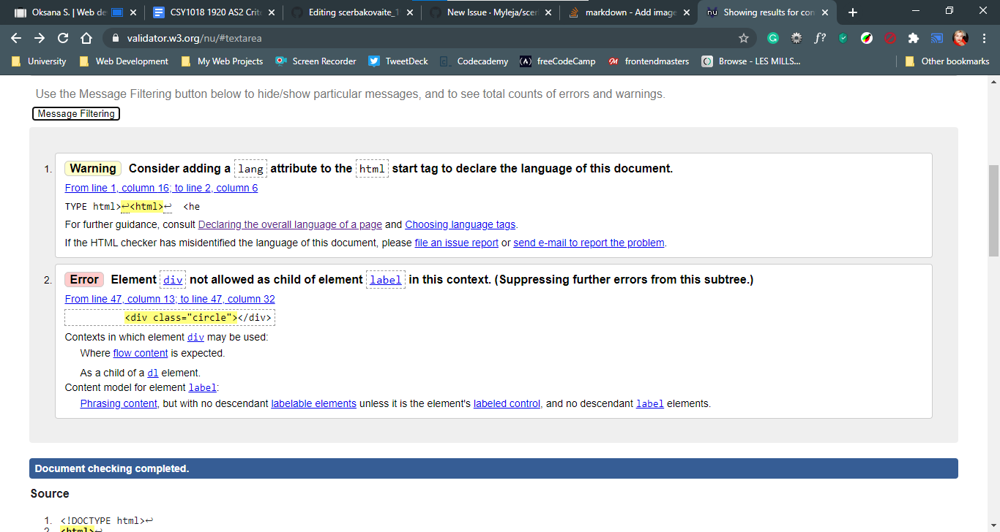

I fixed first erro by adding language to the document <html lang="en">.
For second error i replaced div with a span .

Portfolio.html validation

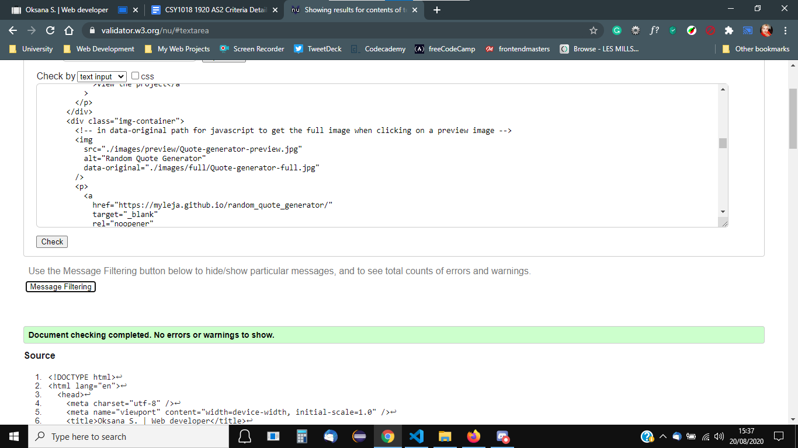

No errors.

Cv.html validation

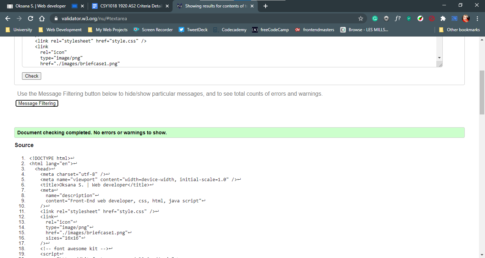

No errors.

Contact.html validation

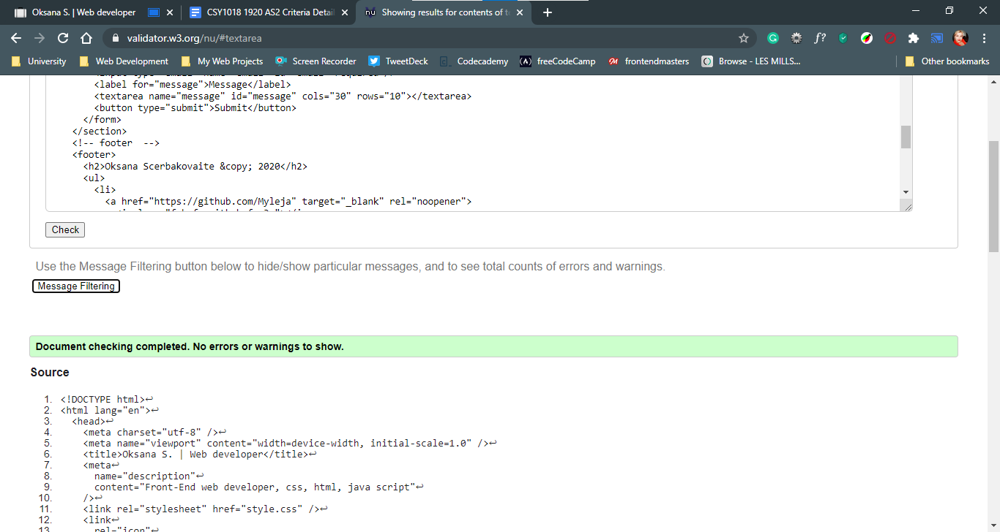

No errors.

Css validation

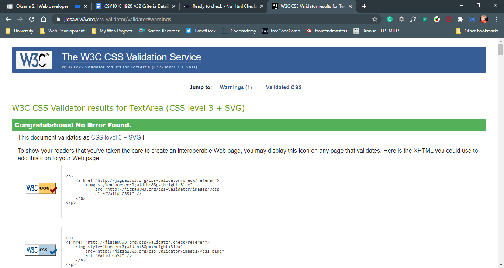

No errors.

Javascript validation

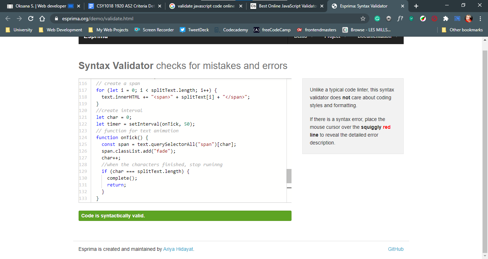

No errors in validator, but i had some erros in a console for javascript.

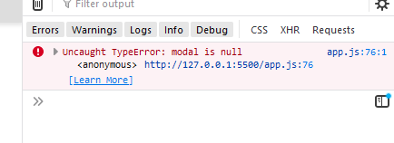
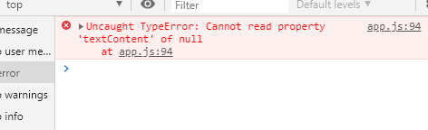
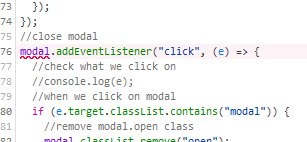
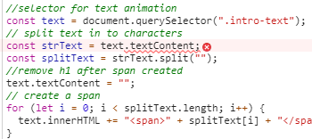

I had to add if statment in a code to check that element is not null.

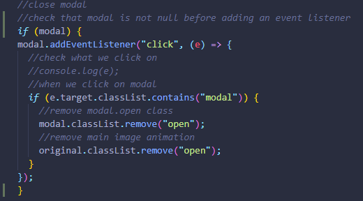
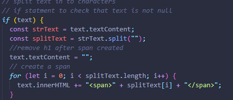

Github heatmap

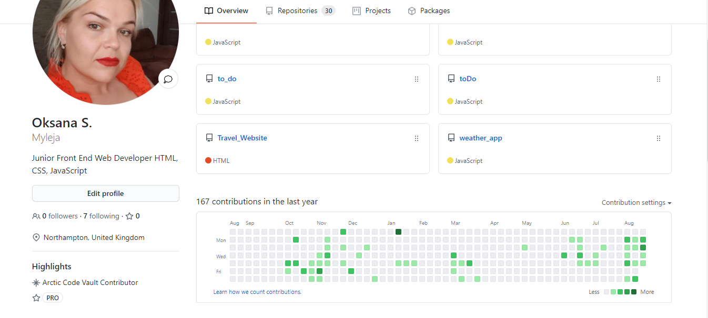

